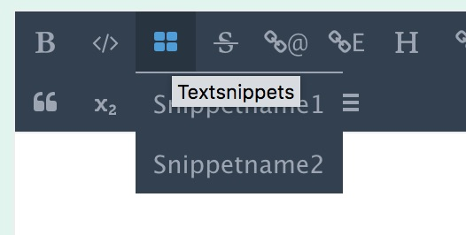

# markitUp! - Integrieren in Deine Entwicklung

Mit der Installation des AddOns markitUp! stehen Dir die default-Profile für markdown und textile zur Verfügung. Sie enthalten _alle_ Erweiterungen des jeweiligen Editors.

Für eine bedienerfreundliche Nutzung im System empfehlen wir Dir noch 3 Schritte für die Integration in REX:
* [Einschränken der Funktionen in den Editoren](#editoren)
* [Integration markdown](#markdown)
* [Integration textile](#textile)

Weitere Informationen und Features:
* [Editoren um Textbausteine erweitern](#textbausteine)
* [Editoren mit Links auf YForm-Tabellen](#yform)
* [Weitere Modul-Beispiele](#beispiele)


<a name="editoren"></a>
### Einschränken der Funktionen in den Editoren

Für den laufenden Betrieb empfielt es sich, die Editoren zu minimalisieren auf die Funktionen, die der Redakteur wirklich braucht. Das macht die Pflege deutlich komfortabler und auch die dadurch entstehenden Internetseiten werden konsistenter und "sauberer" im Code.

Beispiel für einen minimalisierten textile-Editor:

	groupheading[2|3|4|5|6], grouplink[internal|external|mailto|file], unorderedlist, orderedlist, sup, sub


<a name="markdown"></a>
## Integration markdown in ein Modul

### html (Basic)

#### Eingabe-Modul

Die entsprechende css-Klasse für den Editor vergibst Du unter [Profile](/redaxo/index.php?page=markitup/profiles).

	<?php
	if(!rex_addon::get('markitup')->isAvailable()) {
		echo rex_view::error('Dieses Modul ben&ouml;tigt das "markitUp!" Addon.');
	}
	?>
	<div class="form-group">
	  <label class="col-sm-2">Text</label>
	  <div class="col-sm-10">
		<textarea class="form-control markitupEditor-markdown_full" id="value-1" name="REX_INPUT_VALUE[1]">REX_VALUE[1]</textarea>
	  </div>
	</div>


#### Ausgabe-Modul

	<?php
	  if ('REX_VALUE[id=1 isset=1]') {
		echo markitup::parseOutput ('markdown', 'REX_VALUE[id=1 output="html"]');
	  }
	?>


### mit MForm

#### Eingabe-Modul

Die entsprechende css-Klasse für den Editor vergibst Du unter [Profile](/redaxo/index.php?page=markitup/profiles).

	<?php
	if(!rex_addon::get('markitup')->isAvailable()) {
		echo rex_view::error('Dieses Modul ben&ouml;tigt das "markitup" Addon sowie das Profil markitupEditor-markdown_full.');
	}

	// instanziieren
	$mform = new MForm();

		// Text
		$mform->addTextAreaField(2, array('label'=>'Text', 'class'=>'markitupEditor-markdown_full'));


		// Ausrichtung Text
		$mform->addSelectField(10,array(0 => 'zentriert', 1 => 'links-bündig', 2 => 'rechts-bündig'), array('label'=>'Ausrichtung Text', "default-value" => "1"));


	// get formular
	echo $mform->show();

	?>


#### Ausgabe-Modul

	<?php

		$txtalign = "REX_VALUE[10]";
		$text = "REX_VALUE[id=2 output=html]";

		// ########## Ausgabe Backend
		if(rex::isBackend()) {

		echo "<div class=\"row\"><div class=\"col-lg-12\">";
		echo markitup::parseOutput ('markdown', $text);
		echo "</div></div>";

		echo "<br><br>";


		echo "Ausrichtung des Textes: ";
				if ($txtalign == "0") { echo "zentriert "; }
				elseif ($txtalign == "1") { echo "links "; }
				elseif ($txtalign == "2") { echo "rechts "; }
		}


		// ########## Ausgabe Frontend
		else {

			// row
			echo "<div class=\"row\">\n";

			// column
			echo "<div class=\"column ";
				if ($txtalign == "0") { echo "txtalign-center "; }
				elseif ($txtalign == "1") { echo "txtalign-left "; }
				elseif ($txtalign == "2") { echo "txtalign-right "; }
			echo "small-100 medium-100 large-100 xlarge-100\">\n";

			// Text			
			echo markitup::parseOutput ('markdown', $text);

			echo "</div>\n</div>\n\n";
		}
	?>


&uarr; [zurück zur Übersicht](#top)


<a name="textile"></a>
## Integration textile in ein Modul

### html (Basic)

#### Eingabe-Modul

Die entsprechende css-Klasse für den Editor vergibst Du unter [Profile](/redaxo/index.php?page=markitup/profiles).

	<?php
	if(!rex_addon::get('markitup')->isAvailable()) {
		echo rex_view::error('Dieses Modul ben&ouml;tigt das "markitUp!" Addon.');
	}
	?>
	<div class="form-group">
	  <label class="col-sm-2">Text</label>
	  <div class="col-sm-10">
		<textarea class="form-control markitupEditor-textile_full" id="value-1" name="REX_INPUT_VALUE[1]">REX_VALUE[1]</textarea>
	  </div>
	</div>


#### Ausgabe-Modul

	<?php
	  if ('REX_VALUE[id=1 isset=1]') {
		echo markitup::parseOutput ('textile', 'REX_VALUE[id=1 output="html"]');
	  }
	?>


### mit MForm

#### Eingabe-Modul

Die entsprechende css-Klasse für den Editor vergibst Du unter [Profile](/redaxo/index.php?page=markitup/profiles).

	<?php
	if(!rex_addon::get('markitup')->isAvailable()) {
		echo rex_view::error('Dieses Modul ben&ouml;tigt das "markitup" Addon sowie das Profil markitupEditor-textile_default.');
	}

	// instanziieren
	$mform = new MForm();

		// Text
		$mform->addTextAreaField(2, array('label'=>'Text', 'class'=>'markitupEditor-textile_default'));


		// Ausrichtung Text
		$mform->addSelectField(10,array(0 => 'zentriert', 1 => 'links-bündig', 2 => 'rechts-bündig'), array('label'=>'Ausrichtung Text', "default-value" => "1"));


	// get formular
	echo $mform->show();

	?>


#### Ausgabe-Modul

	<?php

		$txtalign = "REX_VALUE[10]";
		$text = "REX_VALUE[id=2 output=html]";

		// ########## Ausgabe Backend
		if(rex::isBackend()) {

		echo "<div class=\"row\"><div class=\"col-lg-12\">";
		echo markitup::parseOutput ('textile', $text);
		echo "</div></div>";

		echo "<br><br>";


		echo "Ausrichtung des Textes: ";
				if ($txtalign == "0") { echo "zentriert "; }
				elseif ($txtalign == "1") { echo "links "; }
				elseif ($txtalign == "2") { echo "rechts "; }
		}


		// ########## Ausgabe Frontend
		else {

			// row
			echo "<div class=\"row\">\n";

			// column
			echo "<div class=\"column ";
				if ($txtalign == "0") { echo "txtalign-center "; }
				elseif ($txtalign == "1") { echo "txtalign-left "; }
				elseif ($txtalign == "2") { echo "txtalign-right "; }
			echo "small-100 medium-100 large-100 xlarge-100\">\n";

			// Text			
			echo markitup::parseOutput ('textile', $text);

			echo "</div>\n</div>\n\n";
		}
	?>

&uarr; [zurück zur Übersicht](#top)


<a name="textbausteine"></a>
### Editoren um Textbausteine erweitern

Über die Clip-Funktion können eigene Textbausteine im Editor bereitgestellt werden. Hier ein Basisbeispiel aus dem mitgelieferten Profil "markdown_full":

    bold,code,clips[Snippetname1=Snippettext1|Snippetname2=Snippettext2],deleted,emaillink, ....



Klick auf "Snippetname1" würde an der Cursorposition den Text "Snippettext1" einfügen. Komplexe oder größere Textbausteine sprengen schnell den Rahmen des Möglichen,
wenn man sie in der Profil-Konfiguration einbaut. Ergänzend kann in der Tabelle "Snippets" eine Textbausteinbibliothek erfasst werden.

Zuerst wird in der Snippet-Liste nach dem Textbaustein "Snippettext1" (um beim Beispiel zu bleiben) gesucht. Gibt es ihn, wird er in den Text eingebaut. Gibt es ihn nicht, wird wie zuvor "Snippettext1" in den Text eingebaut.

Es kann mehrere Snippets gleichen Namens geben für unterschiedliche Backendsprachen. Per Default gilt ein Textbaustein "für alle Sprachen". Wenn zu einem Snippettextnamen
mehrere Sprachvarianten existieren, wird wie folgt ausgewählt:

1. die Variante der aktuell eingestellten Backendsprache. Wenn nicht existent ...
2. ... die Variante "für alle Sprachen". Wenn nicht existent ...
3. ... die Variante einer der Fallback-Sprachen gem. Systemkonfiguration. Wenn nicht existent ...
4. ... wird der Snippettextname als Text übernommen.

&uarr; [zurück zur Übersicht](#top)

<a name="yform"></a>
### Links auf YForm-Tabellen einfügen

> MarkItUp greift nicht direkt auf YForm zu. Somit ist YForm auch keine Installationsvorrausetzung. Wenn dieser Link-Mechanismus für YForm genutzt werden soll,
muss YForm auch verfügbar sein. Das liegt in der Verantwortung des Entwicklers / Administrators

Über die YForm-Funktion können beliebige YForm-Tabellen als Popup-Fenster aufgerufen, ein Eintrag ausgewählt und als Link in den Text eingebaut werden.
Hier ein Basisbeispiel für die Tabellen
- rex_shop_artikel
- rex_shop_kunde
- rex_shop_bestellung

Das einleitende "rex_" wird weggelassen; daraus ergibt sich der Name des Eintrags im Profil:

    ...,yform[shop_artikel|shop_kunde|shop_bestellung],...

Aus diesem Profileintrag wird ein Dropdown-Menu erstellt. Klickt man den Eintrag an, wird ein Auswahl-Popup der Tabelle "rex_xxx" angezeigt, wobei xxx der jeweilige Name des Eintrags ist.

Der Name wird über i18n in den angezeigten Text übersetzt. Dazu muss ein .lang-Eintrag angelegt werden, der folgenden Aufbau hat:
```
profiles_buttons_yform_option_xxx
```
wobei wiederum xxx der Name aus dem Profil ist bzw. der Tabellenname ohne führendes "rex_".

Beispiel:
```
profiles_buttons_yform_option_shop_artikel = Artikel
profiles_buttons_yform_option_shop_kunden = Kunden
profiles_buttons_yform_option_shop_bestellung = Bestellung
```

Hat man den Datensatz ausgewählt, wird ein Link-Eintrag im Editorfeld erzeugt, dessen URL dem Schema `yform:rex_xxx/nnn` folgt. Dabei ist xxx der Name der Tabelle und nnn die Satznummer (Feld `id`) des ausgewählten Datensatzes.

```
/yform:rex_shop_artikel/22
```

Für die Ausgabe werden die Pseudo-URLs in eine konkrete Url umgewandelt. Dabei ist zu beachten:

#### URL-Auflösung im Frondend

Per default werden die Links umgewandelt in 'javascript&colon;void(0);', also neutralisiert.

Über eine eigenen Callback-Funktion können die individuellen Links erzeugt werden. Die Callback-Methode erhält ein
preg-match-Array mit den Elementen `table_name` und `id`. Die Funktion muss daraus die URL aufbauen und den String
mit Return zurückmelden.

Da nur eine Funktion zugewiesen werden kann, muss sie ggf. zwischen Frontend und Backend
unterscheiden und auch ggf. Berechtigungsprüfungen durchführen.

#### URL-Auflösung im Backend

Im Backend wird zumindest verlangt, dass ein Benutzer angemeldet ist. Ansonsten werden die Links neutralisiert.

Im Backend werden die Links in JS-Aufrufe umgewandelt: 'javascript&colon;markitupYformOpen(nummer,tablename,id);'. Damit wird der Datensatz in einem neuen Edit-Fenster angezeigt.
- Die Nummer ist zufällig erzeugt und benennt das Fenster
- Der Tabellenname ist aus dem Link entnommen
- Die Satznummer ist aus dem Link entnommen.

Alternativ kann der Link auch über die Callback-Funktion erzeugt werden.

#### URL-Auflösung mit Callback

Das Beispiel zeigt gleich zwei Punkte:
- Die Callback-Funktion wird über Zuweisung an `markitup::$yform_callback` festgelegt.
- Die Funktion erzeugt im Backend den Standard-Link und im Frontend einen individuellen.
- Wenn keine Berechtigung im Frontend vorliegt, wird ein Null-Link erzeugt.

```PHP
markitup::$yform_callback = function ($link) {
    if( rex:isBackend() ) {
        return markitup::createYFormLink( $link );
    }
    if( .... autorisiert ....) return 'http://mydomain/daten/'.$link['table_name'].'/edit/'.$link['id'];
    return rex_article::getNotfoundArticle()->getUrl();
};
```

#### Id is in Use - Löschen absichern

Es steht eine Funktion zur Verfügung, mit der Yform-Links in den Textfeldern überprüft werden können

```php
markitup::yformLinkInUse( $table_name, $data_id, $tableset=null, $result=false )
```
Die Funktion überprüft für die angegebenen Tabellen (`$tableset`) in den Feldern vom Typ `text`, `mediumtext` und `varchar...`, ob
in ihnen der zu prüfende Link (`$table_name, $data_id`) vorkommt.

Für `$type_in_scope` ist in der Klasse `markitup` die Vorgabe
```php
static $type_in_scope = [
    'varchar' => 'Type LIKE \'varchar%\'',
    'text' => 'Type = \'text\'',
    'mediumtext' => 'Type = \'mediumtext\'',
];
```

Beispiel:
- Aus der YForm-Tabelle `rex_shop_kunde` soll der Datensatz `123` wird gelöscht werden.
- Referenzen kommen nur in den Core-Tabellen (Artikel, Media) vor.
- Gesucht wird nach dem Eintrag `yform:$table_name/$data_id`, also hier: `yform:rex_shop_kunde/123`

| Parameter | Erklärung | Beispiel |
|--|--|--|
| $table_name | Der Name der Tabelle, deren Eintrag geprüft wird | rex_shop_kunde |
| $data_id | Die ID des Datensatzes, der geprüft wird | 123 |
| $tableset | Die Liste der Tabellen, in denen nach dem Link gesucht wird | 1 |
| $result | Suchverhalten (false,true,Zahl) |  |


Für `$tableset` gibt es die Varianten
- null => **Alle** Tabellen der Datenbank durchsuchen (sicher, aber aufwendig und daher langsam)
- 1 => Core-Tabellen rex_article, rex_article_slice und rex_media durchsuchen
- 2 => YForm-Tabellen durchsuchen
- 3 => Kombination aus 1 und 2
- `['tabelle_1',...]` = nur die Liste der angegebenen Tabellen durchsuchen.
- alle anderen Eingaben => keine Suche, Rückmeldung ist `false` = nicht in Benutzung

Im Normalfall bricht die Funktion nach dem ersten gefundenen Eintrag bereits mit `return true` ab.
Mit `$esult = true` wird stets eine Suche über alle angegebenen Tabellen durchgeführt und alle
gefundenen Einträge als Array der Satznummern (id) zurückgemeldet. Alternativ kann auch eine Zahl angegeben werden
`$result = 4`; dann werden je Tabelle maximal n (hier 4) IDs zurückgemeldet.

Die Funktion kann z.B. über den Extension-Point `YFORM_DATA_DELETE` genutzt werden; im Beispiel wird die YForm-Tabelle `rex_shop_kunde` überwacht:

```php
\rex_extension::register('YFORM_DATA_DELETE', function( \rex_extension_point $ep ){
    $table_name = $ep->getParam('table')->getTablename();
    if( 'rex_shop_kunde' !== $table_name ) return true;
    return !markitup::yformLinkInUse( $table_name, $ep->getParam('data_id'), 1 );
});
```

&uarr; [zurück zur Übersicht](#top)

#### Id is in Use - Löschen absichern in eigenen Abfragen

Zusätzlich zur allgemeinen Methode `markitup::yformLinkInUse(...)` kann man einfach eigene Abfragen
konzipieren. Hierzu liefert die Methode
```php
markitup::yformInUseWhere( $target_table, $table_name, $data_id, $type_in_scope=null, $fields_in_scope=null )
```
eine massgeschneiderte Where-Klausel. Z.B. Kann die Suche nach YForm-Links mit der Suche nach anderen
Löschausschlußkriterien in derselben Tabelle kombiniert werden oder die recht pauschale Vorgehensweise
von `yformLinkInUse` feiner eingestellt werden.

| Parameter | Erklärung | Beispiel |
|--|--|--|
| $target_table | Der Name der Tabelle, in der nach dem Link gesucht wird | rex_article_slice |
| $table_name | Der Name der Tabelle, deren Eintrag geprüft wird | rex_shop_kunde |
| $data_id | Die ID des Datensatzes, der geprüft wird | 123 |
| $type_in_scope | Array; legt fest, welche Feldtypen durchsucht werden | ['Type LIKE "%text"'] |
| $fields_in_scope | Array; legt fest, welche Felder durchsucht werden | ['value1','value2'] |

Alle Elemente in `$type_in_scope` bzw. `$fields_in_scope` sind ODER-verknüpft. Beide untereinander sind
jedoch UND-verknüpft.

Die `target_table` wird für die Suche nach den Feldern benutzt, die die angegeben Typen haben, und
um sicherzustellen, dass die Felder ($`fields_in_scope`) in der Tabelle vorkommen.

Ist `$type_in_scope` nicht angegeben (`null`), wird auf `markitup::$type_in_scope` zurückgegriffen. Ein leerer
`$type_in_scope` muss als `[]` angegeben werden.

* Wird nur `$type_in_scope` angegeben, werden alle Felder der angegebenen Typen untersucht.
* Wird nur `$fields_in_scope` angegeben und `$type_in_scope` ist leer (`[]`), werden alle angegebenen Felder untersucht.
* Werden beide angegeben, werden nur Felder untersucht, die einem der angegebenen Typen entsprechen UND in der Feldliste vorkommen.


&uarr; [zurück zur Übersicht](#top)

<a name="beispiele"></a>
## Weitere Modul-Beispiele

... findest Du im Installer und via
* [Redaxo-Demo](https://github.com/FriendsOfREDAXO/demo_base)
* [Redaxo-Onepager](https://github.com/FriendsOfREDAXO/demo_onepage)
* [Redaxo Modul-Sammlung](https://github.com/FriendsOfREDAXO/Modulsammlung)

&uarr; [zurück zur Übersicht](#top)
